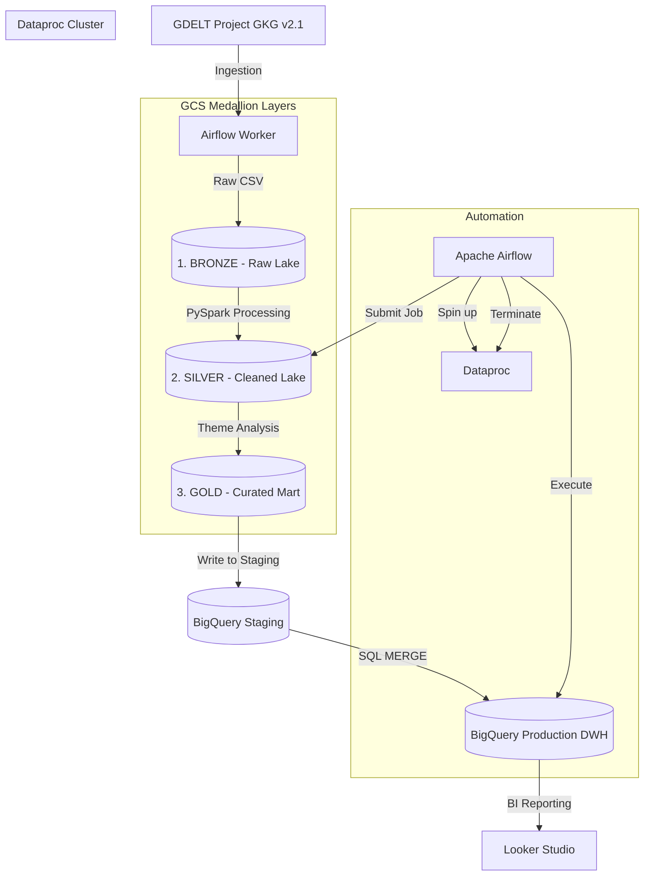

# 📊 GDELT Global Sentiment & Economic Trends Pipeline

[](https://cloud.google.com/)
[](https://airflow.apache.org/)
[](https://spark.apache.org/)
[](https://www.terraform.io/)

Dự án này xây dựng một **Hệ thống dữ liệu lớn (Big Data Pipeline)** tự động hóa hoàn toàn quy trình từ thu thập, xử lý đến phân tích dữ liệu tin tức toàn cầu từ **GDELT Project (Global Knowledge Graph)**. Hệ thống được thiết kế theo kiến trúc **Medallion (Bronze ➡️ Silver ➡️ Gold)** hiện đại, vận hành trên nền tảng **Google Cloud Platform (GCP)** với sự điều phối của **Apache Airflow**.

---

## 🏗️ Kiến Trúc Hệ Thống (System Architecture)

Dự án áp dụng mô hình **Lakehouse** kết hợp giữa tính linh hoạt của Data Lake (GCS) và hiệu năng của Data Warehouse (BigQuery).



---

## 🛠️ Công Nghệ Sử Dụng (Tech Stack)

*   **Infrastructure as Code:** [Terraform](file:///d:/H/Projects/de/terraform/main.tf) quản lý GCS Buckets, BigQuery Datasets & Tables.
*   **Orchestration:** [Apache Airflow](file:///d:/H/Projects/de/dags/gdel_gcp_dataproc_pipeline.py) chạy trên Docker, điều phối toàn bộ Workflow E2E.
*   **Storage:** Google Cloud Storage (Data Lake) & BigQuery (Data Warehouse).
*   **Compute:** Google Cloud Dataproc (Managed Spark) để xử lý dữ liệu quy mô lớn.
*   **Processing:** PySpark (DataFrame API) thực hiện các biến đổi dữ liệu phức tạp.
*   **Environment:** [uv](https://github.com/astral-sh/uv) quản lý Python dependencies hiệu năng cao.

---

## 📂 Quy Trình Xử Lý Dữ Liệu (Medallion Pipeline)

### 1. Tầng Bronze (Dữ liệu Thô)
*   **Input:** Dữ liệu GKG (Global Knowledge Graph) v2.1 từ GDELT.
*   **Xử lý:** Airflow tự động tải file ZIP, giải nén và nạp trực tiếp lên `gs://bronze/`. Dữ liệu được giữ nguyên bản 27 cột để phục vụ việc tái lập (reprocessing) khi cần.

### 2. Tầng Silver (Dữ liệu Sạch)
*   **Xử lý:** [PySpark Job](file:///d:/H/Projects/de/scripts/pyspark_gcp.py) thực hiện:
    *   Ép kiểu dữ liệu chuẩn (`Timestamp`, `Float`).
    *   Trích xuất `ToneScore` (điểm cảm xúc) từ các cấu trúc chuỗi phức tạp.
    *   Loại bỏ dữ liệu rác và bản ghi khuyết thiếu.
*   **Output:** Lưu trữ tại `gs://silver/` dưới định dạng Parquet tối ưu hóa dung lượng.

### 3. Tầng Gold (Dữ liệu Phân Tích)
*   **Xử lý:** 
    *   Sử dụng kỹ thuật `explode` để bóc tách danh sách các chủ đề (`Themes`) thành từng dòng độc lập.
    *   Lọc các xu hướng liên quan đến **Kinh tế vĩ mô (ECON_*)**.
*   **Output:** Ghi vào BigQuery Production thông qua cơ chế chống trùng lặp.

---

## 🚀 Tính Năng Nổi Bật (Engineering Excellence)

*   **Idempotency (Tính khả định):** Sử dụng mô hình **Staging + SQL MERGE** [gdel_gcp_dataproc_pipeline.py:L63-76](file:///d:/H/Projects/de/dags/gdel_gcp_dataproc_pipeline.py#L63-76). Đảm bảo pipeline có thể chạy lại bất kỳ lúc nào mà không gây trùng lặp dữ liệu trong Warehouse.
*   **Cost Optimization:** 
    *   Sử dụng **Ephemeral Dataproc Clusters**: Cụm Spark chỉ được bật lên khi cần xử lý và tự động xóa ngay sau khi hoàn thành để tiết kiệm chi phí.
    *   **BigQuery Partitioning & Clustering:** Bảng dữ liệu được phân vùng theo `DATE` và gom nhóm theo `Theme`, giúp giảm tới 60-80% chi phí truy vấn và tăng tốc độ báo cáo.
*   **Infrastructure as Code (IaC):** Toàn bộ hạ tầng GCP được định nghĩa bằng [Terraform](file:///d:/H/Projects/de/terraform/), giúp việc triển khai (deployment) trở nên nhất quán và nhanh chóng.
*   **Automated E2E Flow:** Từ việc đồng bộ code Spark từ local lên Cloud, đến việc dọn dẹp dữ liệu tạm, tất cả đều được tự động hóa 100% qua Airflow.

---

## 📁 Cấu Trúc Thư Mục

```text
├── dags/                # Định nghĩa Airflow DAGs (Cloud & Local)
├── scripts/             # Script xử lý PySpark (Core logic)
├── terraform/           # Mã nguồn quản lý hạ tầng GCP
├── docker/              # Cấu hình môi trường Airflow Docker
├── notebooks/           # Phân tích dữ liệu (EDA) & Thử nghiệm
├── data/                # Dữ liệu mẫu (chỉ dùng cho local development)
└── pyproject.toml       # Quản lý dependencies bằng uv
```

---

## 🛠️ Hướng Dẫn Triển Khai

1.  **Hạ tầng:** Cài đặt [Terraform](file:///d:/H/Projects/de/terraform/) và chạy `terraform apply` để khởi tạo tài nguyên trên GCP.
2.  **Airflow:** 
    *   Cấu hình GCP Connection trong Airflow UI.
    *   Thiết lập các Variables (`gcp_project_id`, `gcs_data_lake_bucket`, ...).
    *   Chạy `docker-compose up` để khởi động môi trường.
3.  **Vận hành:** Kích hoạt DAG `gdel_gcp_dataproc_pipeline` để bắt đầu luồng xử lý tự động.

---
*Dự án được phát triển nhằm minh chứng khả năng thiết kế và vận hành hệ thống Big Data chuyên nghiệp trên nền tảng Cloud.*
