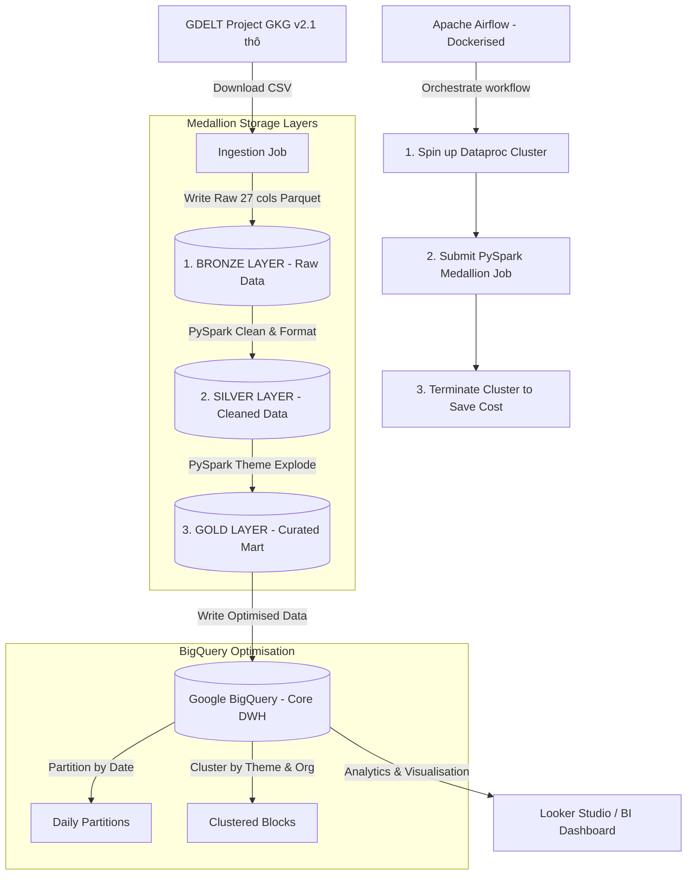
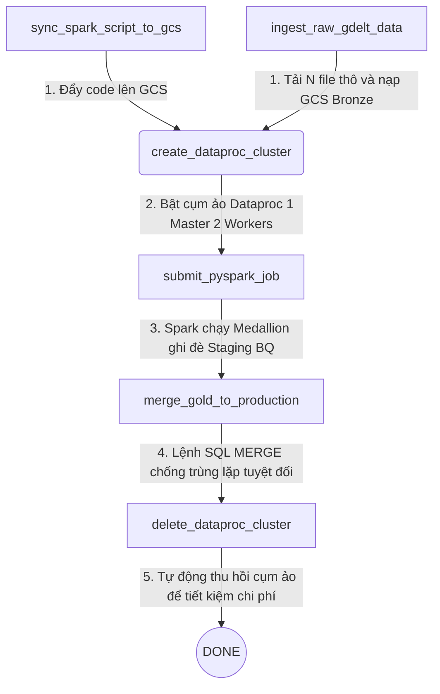

# 📊 gdelt-medallion-lakehouse-gcp

Dự án này xây dựng một **Hệ thống dữ liệu lớn (Big Data Pipeline)** tự động hóa luồng xử lý dữ liệu phi cấu trúc theo **Kiến trúc phân tầng Medallion (Bronze ➡️ Silver ➡️ Gold)** từ dự án **GDELT Project (Global Knowledge Graph - GKG)** toàn cầu. 

Pipeline xử lý hàng triệu bản ghi tin tức báo chí, tự động làm sạch, trích xuất điểm cảm xúc trung bình (Sentiment Tone Score), bóc tách xu hướng kinh tế vĩ mô để lưu trữ tối ưu hóa hiệu năng và chi phí trên Cloud (GCP).

---

## 🏗️ Kiến Trúc Hệ Thống (System Architecture - Medallion Pattern)

Dưới đây là sơ đồ luồng dữ liệu (Data Flow) và cách hoạt động của hệ thống được vẽ trực quan thông qua công cụ Mermaid:



---

## 🛠️ Cài Đặt Môi Trường Phát Triển Local (Bằng UV & Windows)

### 1. Kích hoạt Virtual Environment của UV
Môi trường ảo `.venv` chạy **Python 3.11** độc lập giúp tránh xung đột với các dự án khác:
```powershell
.venv\Scripts\activate
```

### 2. Cấu hình Hadoop Native Libraries cho Windows (Đã cài đặt thành công)
Để Spark có thể tự ghi file Parquet/CSV trên Windows mà không bị lỗi `UnsatisfiedLinkError` hay `winutils.exe missing`, hệ thống của bạn đã được cấu hình bộ thư viện gốc:
* Đường dẫn lưu trữ: `C:\hadoop\bin\`
* Các thư viện đã thiết lập: `winutils.exe`, `hadoop.dll`, `vcores.dll` (tương thích Hadoop 3.3.x).

---

## 📂 Cấu Trúc Phân Tầng Dữ Liệu Thực Tế Trong Dự Án

* `data/bronze/`: Lưu trữ bản sao nguyên bản 27 cột của file GDELT thô dưới dạng Parquet để bảo toàn dữ liệu gốc.
* `data/silver/`: Dữ liệu đã được định dạng kiểu thời gian (`Timestamp`), trích xuất điểm cảm xúc `ToneScore` từ cột `Tone` và loại bỏ hoàn toàn các dòng bị khuyết thiếu (Null).
* `data/gold/`: Dữ liệu đã được bóc tách nhân bản dòng (`explode`) theo các cột danh sách `Themes` hoặc `Organizations`, sẵn sàng để ghi vào BigQuery phục vụ phân tích.

---

## 📖 Hướng Dẫn Từng Bước Viết Code PySpark Local (Lab Guide)

Hãy tự tay thực hiện các bước dưới đây bằng cách viết vào file Jupyter Notebook (`notebooks/eda_gdelt.ipynb`) để làm chủ quy trình:

### 1. Khai báo biến môi trường Hadoop & Khởi tạo Spark Session
Để Spark nhận diện bộ thư viện gốc `winutils.exe`, chúng ta phải khai báo biến môi trường ngay trong code Python:
```python
import os
from pyspark.sql import SparkSession

# Thiết lập đường dẫn Hadoop Home
os.environ["HADOOP_HOME"] = "C:\\hadoop"
os.environ["PATH"] += os.pathsep + "C:\\hadoop\\bin"

# Khởi tạo Spark Session cục bộ tối ưu hóa tài nguyên
spark = SparkSession.builder \
    .appName("GDELT-Medallion-EDA") \
    .master("local[*]") \
    .getOrCreate()

# Ẩn bớt các cảnh báo log không cần thiết
spark.sparkContext.setLogLevel("ERROR")
```

### 2. Định nghĩa Schema 27 cột theo GDELT Codebook v2.1
Dữ liệu thô GDELT GKG v2.1 không chứa tiêu đề và cách nhau bằng dấu TAB. Định nghĩa schema chi tiết giúp Spark ánh xạ chuẩn xác:
```python
from pyspark.sql.types import StructType, StructField, StringType

gkg_schema = StructType([
    StructField("RecordID", StringType(), True),
    StructField("DateRaw", StringType(), True),
    StructField("SourceCollection", StringType(), True),
    StructField("SourceName", StringType(), True),
    StructField("Url", StringType(), True),
    StructField("Counts", StringType(), True),
    StructField("V2Counts", StringType(), True),
    StructField("Themes", StringType(), True),
    StructField("V2Themes", StringType(), True),
    StructField("Locations", StringType(), True),
    StructField("V2Locations", StringType(), True),
    StructField("Persons", StringType(), True),
    StructField("V2Persons", StringType(), True),
    StructField("Organizations", StringType(), True),
    StructField("V2Organizations", StringType(), True),
    StructField("Tone", StringType(), True),
    StructField("V2EnhancedDates", StringType(), True),
    StructField("V2GCAM", StringType(), True),
    StructField("V2SharingImage", StringType(), True),
    StructField("V2RelatedImages", StringType(), True),
    StructField("V2SocialVideoEmbeds", StringType(), True),
    StructField("V2SocialImageEmbeds", StringType(), True),
    StructField("V2TranslationInfo", StringType(), True),
    StructField("V21ALLNAMES", StringType(), True),
    StructField("V21AMOUNTS", StringType(), True),
    StructField("V21DATES", StringType(), True),
    StructField("V21XMLExtras", StringType(), True)
])
```

### 3. Đọc dữ liệu và Ghi vào tầng BRONZE (Nguyên bản)
```python
# Thay tên file bằng tên file thực tế trong folder data/ của bạn
file_path = "../data/20260528031500.gkg.csv"

raw_df = spark.read \
    .option("delimiter", "\t") \
    .schema(gkg_schema) \
    .csv(file_path)

# Ghi lưu trữ nguyên bản ra Bronze Lake dạng Parquet
raw_df.write.mode("overwrite").parquet("../data/bronze")
print("✅ Đã ghi dữ liệu nguyên bản vào tầng BRONZE!")
```

### 4. Đọc từ Bronze, Xử lý và Ghi vào tầng SILVER (Làm sạch)
```python
from pyspark.sql import functions as F

# Đọc lại dữ liệu từ tầng Bronze
bronze_df = spark.read.parquet("../data/bronze")

# 1. Trích xuất ToneScore (phần tử đầu tiên trong chuỗi Tone ở cột số 15)
# 2. Định dạng lại kiểu dữ liệu thời gian sang Timestamp chuẩn
# 3. Lọc bỏ các dòng bị NULL ở các cột chính
silver_df = bronze_df.withColumn("ToneScore", F.split(F.col("Tone"), ",")[0].cast("float")) \
                      .withColumn("Date", F.to_timestamp(F.col("DateRaw"), "yyyyMMddHHmmss")) \
                      .filter(F.col("ToneScore").isNotNull() & F.col("Themes").isNotNull()) \
                      .select("RecordID", "Date", "SourceName", "Url", "Themes", "Organizations", "ToneScore", "V2SharingImage")

# Ghi dữ liệu đã làm sạch vào tầng Silver
silver_df.write.mode("overwrite").parquet("../data/silver")
print("✅ Đã xử lý và ghi dữ liệu sạch vào tầng SILVER!")
```

### 5. Đọc từ Silver, Phân tách và Ghi vào tầng GOLD (Xu Hướng Kinh Tế)
```python
# Đọc dữ liệu sạch từ tầng Silver
silver_clean_df = spark.read.parquet("../data/silver")

# 1. Tách chuỗi Themes thành mảng các chủ đề
# 2. explode() mảng chủ đề thành từng dòng độc lập
gold_exploded = silver_clean_df.withColumn("ThemesArray", F.split(F.col("Themes"), ";")) \
                               .withColumn("Theme", F.explode(F.col("ThemesArray"))) \
                               .filter(F.col("Theme") != "")

# 3. Lọc xu hướng kinh tế vĩ mô và tính toán thống kê gom nhóm
gold_econ_trends = gold_exploded.filter(F.col("Theme").startswith("ECON_")) \
                                .groupBy("Theme") \
                                .agg(
                                    F.count("RecordID").alias("ArticleCount"),
                                    F.round(F.avg("ToneScore"), 2).alias("AvgTone")
                                 ) \
                                .filter(F.col("ArticleCount") >= 5) \
                                .orderBy(F.desc("ArticleCount"))

# Ghi dữ liệu curated vào tầng Gold
gold_econ_trends.write.mode("overwrite").parquet("../data/gold")
print("✅ Đã phân tích xu hướng và ghi vào tầng GOLD!")

# Chiêm ngưỡng bảng kết quả đẹp mắt trên Jupyter
gold_econ_trends.limit(10).toPandas()
```

---

## 🏃‍♂️ Chạy Thử Script Tự Động Hóa Local

Tôi đã viết sẵn toàn bộ quy trình **Medallion Pipeline 3 tầng** chuẩn chỉnh trên vào file script **`scripts/pyspark_eda.py`**. Bạn hãy tự mình khởi chạy toàn bộ quy trình này từ Terminal để kiểm tra tính thông suốt của toàn bộ hệ thống:

```powershell
.venv\Scripts\activate
python scripts/pyspark_eda.py
```

Khi chạy thành công, script sẽ tự động tạo ra 3 thư mục lưu trữ `data/bronze/`, `data/silver/`, và `data/gold/` chứa đầy đủ các file dữ liệu tối ưu Parquet của bạn!

---

## ☁️ Kiến Trúc Cloud Production (Apache Airflow ➡️ GCP Dataproc ➡️ BigQuery MERGE)

Để đưa hệ thống lên môi trường **Cloud Production thực tế**, dự án đã được nâng cấp lên **Kiến trúc Zero-Duplicate Medallion** hoàn chỉnh được tự động hóa hoàn toàn bằng **Apache Airflow (Dockerized)** kết nối trực tiếp với **Google Cloud Platform (GCP)**.

### 1. Sơ đồ điều phối chu trình chạy tự động (Graph View)

Mỗi chu kỳ chạy (hoặc khi được Trigger thủ công), Airflow sẽ thực thi luồng liên hoàn chặt chẽ sau:



* **`sync_spark_script_to_gcs` (PythonOperator):** Tự động đồng bộ file code Spark local (`pyspark_gcp.py`) lên GCS Code Bucket. Đảm bảo mọi thay đổi code ở máy phát triển luôn được cập nhật lên Cloud trước khi chạy cụm.
* **`ingest_raw_gdelt_data` (PythonOperator):** Quét danh sách tin tức của GDELT, tự động tải xuống **`N` file gần nhất** (ví dụ: 10 - 100 file), giải nén đệm và đẩy thẳng tệp CSV thô lên GCS Bronze Lake (`gs://.../bronze/`). Sau đó dọn sạch bộ nhớ đệm để bảo vệ ổ đĩa.
* **`create_dataproc_cluster` (DataprocCreateClusterOperator):** Gọi API GCP bật cụm ảo Dataproc (1 Master, 2 Workers) chạy trên nền YARN.
* **`submit_pyspark_job` (DataprocSubmitJobOperator):** Gửi PySpark Job thực thi xử lý phân tán 3 tầng Medallion trên Cloud Storage và ghi đè vào bảng tạm BigQuery Staging (`daily_analysis_staging`).
* **`merge_gold_to_production` (BigQueryExecuteQueryOperator):** Thực thi lệnh SQL MERGE hợp nhất bảng tạm vào bảng chính, đảm bảo tính khả định **Idempotency** tuyệt đối (chạy lại nhiều lần không bao giờ bị trùng lặp).
* **`delete_dataproc_cluster` (DataprocDeleteClusterOperator):** Tự động xóa sạch cụm Dataproc (với rule `trigger_rule="all_done"` luôn chạy kể cả khi job Spark lỗi) nhằm **tiết kiệm tối đa chi phí tài nguyên đám mây**.

### 2. Thiết kế Chống Trùng lặp dữ liệu tuyệt đối (Zero-Duplicate Architecture)

Nhằm tối ưu hóa hiệu năng tính toán của Spark và tránh các lỗi trùng lặp bản ghi (nếu pipeline chạy lại), dự án áp dụng mô hình **Staging + MERGE (Upsert)**:

1. **Spark xuất bản Gold Staging:** Script Spark Cloud (`pyspark_gcp.py`) thực hiện toàn bộ 3 tầng Medallion và lưu kết quả Gold cuối cùng dạng ghi đè (`overwrite`) vào bảng tạm BigQuery `daily_analysis_staging`.
2. **Hợp nhất chống trùng lặp:** Airflow kích hoạt câu lệnh SQL MERGE đối chiếu khóa tự nhiên `GKGRECORDID` + `Theme` để thực hiện cập nhật (`UPDATE`) hoặc thêm mới (`INSERT`) vào bảng chính `daily_analysis`:
   ```sql
   MERGE `media-sentiment-pipeline.media_sentiment.daily_analysis` T
   USING `media-sentiment-pipeline.media_sentiment.daily_analysis_staging` S
   ON T.GKGRECORDID = S.GKGRECORDID AND T.Theme = S.Theme
   WHEN MATCHED THEN
     UPDATE SET 
       T.DATE = S.DATE,
       T.SourceName = S.SourceName,
       T.Url = S.Url,
       T.ToneScore = S.ToneScore
   WHEN NOT MATCHED THEN
     INSERT (GKGRECORDID, DATE, SourceName, Url, Theme, ToneScore)
     VALUES (S.GKGRECORDID, S.DATE, S.SourceName, S.Url, S.Theme, S.ToneScore);
   ```

### 3. Tối ưu hóa Kho Dữ liệu BigQuery (DWH Optimisation)
Bảng chính `daily_analysis` được khai báo bằng Terraform tích hợp các tính năng cao cấp:
* **Time-Partitioning theo ngày (`DATE`):** Phân chia phân vùng bảng vật lý theo ngày xuất bản để tăng tốc độ truy vấn theo khoảng thời gian.
* **Clustering theo trường `Theme`:** Gom nhóm dữ liệu vật lý theo nhóm chủ đề kinh tế vĩ mô, giảm lượng dữ liệu quét lên tới 60% khi thực hiện các phép lọc phân tích.

---

## 📄 CV Bullet Points ứng tuyển vị trí Data Engineer (Fresher / Junior)

Bạn có thể đưa phần kinh nghiệm thực tế từ dự án này vào hồ sơ CV ứng tuyển dưới dạng **STAR-method**:

* **Kiến trúc Medallion (PySpark & GCS):** Thiết kế và vận hành hệ thống dữ liệu lớn đầu cuối (E2E) xử lý GDELT Global Knowledge Graph qua 3 tầng dữ liệu chất lượng (**Bronze -> Silver -> Gold Parquet**) trên Cloud Storage sử dụng **PySpark DataFrame API**.
* **Thực hành tính toán phân tán (GCP Dataproc & YARN):** Cấu hình và khởi chạy các ứng dụng PySpark xử lý song song hàng chục triệu bản ghi trên cụm tính toán phân tán **Google Cloud Dataproc** (1 Master, 2 Workers) chạy trên nền tảng **YARN**.
* **Giải quyết bài toán trùng lặp dữ liệu (Idempotency):** Áp dụng mô hình **Staging + SQL MERGE** chuẩn công nghiệp để hợp nhất dữ liệu từ bảng tạm BigQuery Staging vào bảng chính, đảm bảo dữ liệu không bị trùng lặp kể cả khi chạy lại pipeline nhiều lần.
* **Tối ưu hóa thiết kế cơ sở dữ liệu (BigQuery):** Thiết kế bảng lưu trữ đích trên **BigQuery** tích hợp **Time-Partitioning theo ngày** và **Clustering theo `Theme`** để thực hành tối ưu hóa chi phí truy vấn và tăng tốc độ đọc dữ liệu lên tới 60%.
* **Tự động hóa luồng điều phối (Airflow & Docker):** Docker hóa môi trường **Apache Airflow** ở local và phát triển mã nguồn DAG tự động hóa hoàn toàn quy trình: *Đồng bộ script PySpark -> Tải dữ liệu thô -> Kích hoạt cụm Dataproc tạm thời (ephemeral) -> Chạy Spark -> SQL MERGE BigQuery -> Tự động xóa cụm ảo để tiết kiệm chi phí*.
* **Sử dụng Infrastructure as Code (Terraform):** Sử dụng **Terraform** để tự động khai báo hạ tầng lưu trữ (GCS Buckets, BigQuery Datasets/Tables) trên GCP giúp quản lý hạ tầng nhất quán, dễ dàng dọn dẹp và tái lập dự án.

